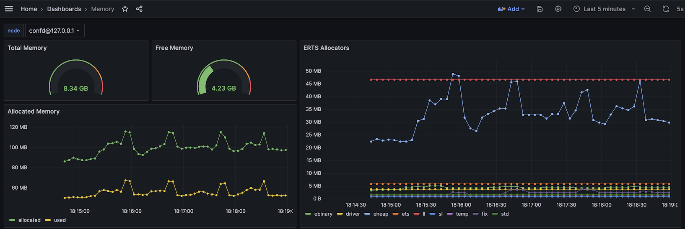

# Custom Metrics
> Hook in your own metrics collector

## Setup the collector

You can configure your own metrics collector to
be invoked by the `system_monitor`. In this example
we will setup a memory metrics collector.



Metrics collection is only done if the `callback_mod` 
application env var is set, indicating that collected
data should be exported. Typically it is set to either
`system_monitor_pg` for local export to Postgres running
on the same Host, or `system_monitor_producer` in case of
external export (automatically taken care of,
see also: [CONSUMER_PRODUCER](CONSUMER_PRODUCER.md) )

The configuration to enable a custom metric is done
by adding a tuple containing two elements to 
the `custom_metrics` application env variable in the
`system_monitor.app.src` file.

Example: Adding the `system_monitor_memory_metric` collector.

```erlang
      ...
      %% List of: {Type :: atom(), Module :: atom()}
    , {custom_metrics,
       [{memory, system_monitor_memory_metric}]}
       ...
```

`Module` should be a gen\_server with functions for dealing with custom metrics.
The Module gen\_server will be started by the system_monitor supervisor.
`Type` is used by the system_monitor to identify the metric.


The Module must export the following four functions:
__monitor()__, __query(Type)__,  __params(Type, Event)__,
__table(Type)__ as described below.

### Exported functions from the callback module

__monitor()__ - Should return a 4-element tuple:
__{Module, Function, RunMonitorAtTerminate, NumberOfTicks}__ where
_Module:Function/0_ will be invoked every _NumberOfTicks_ second.
The _RunMonitorAtTerminate_ is a boolean indicating if the function
also sould be invoked in the event of the termination of the system_monitor.

The metric function collects the data and should invoke the
`system_monitor_callback:produce(Type, ListOfEvents)`,
which will send the list of events to the DB backend.

Example:

```erlang
monitor() ->
    {?MODULE, collect, false, 5}.
```

__query(Type)__ - Should return a SQL insert statement as a binary string which
is used by the Postgres backend to insert the collected metric. Example:

```erlang
query(memory) ->
    <<"insert into memory (node, ts, total, free, allocated) VALUES ($1, $2, $3, $4, $5);">>.
```

__params(Type, Event)__ - Should return a list of values to be injected
into the SQL insert string. Example:

```erlang
params(memory, {memory, Node, TS, Tot, Free, Allocated} = _Event) ->
  [ to_str(Node)
  , system_monitor_pg:ts_to_timestamp(TS)
  , to_str(Tot)
  , to_str(Free)
  , to_str(Allocated)
  ].
```

__table(Type)__ - Return the table name as a binary string. Example:

```erlang
table(memory) ->
    <<"memory">>.
```


## Create the DB table

To create the actual DB (Postgres) table, a script similar to
the [40-memory](docker/db/40-memory.sh) could be used.

Start by copy this script and name it prefixed with a number (defining
the order when it will be run by docker-compose).
Then modify it to fit your new table.

The script can be used both to add a new table
as well as part of the docker-compose run when setting up the
container the very first time.

When manually invoking it a `<host>` argument can be provided to 
the script. Example

```shell
$ ./40-memory.sh localhost
```

## Create a Grafana Dashboard

When you have created a dasboard in Grafana for your metric
you can export it from Grafana and store it similar to:
`docker/grafana/dashboards/memory.json`.

This will ensure that it will be added to Grafana the next time you
create its docker container.
